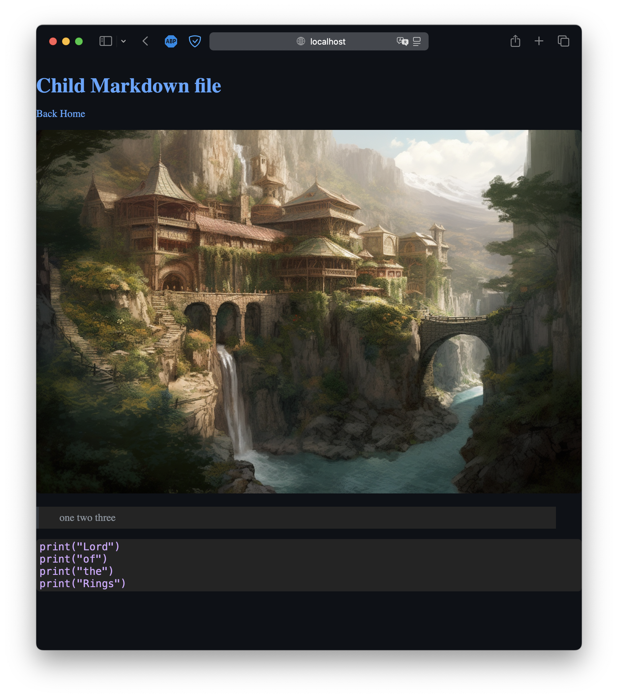

# Static Site Generator

## Overview

This project is a static site generator that converts Markdown files into HTML pages using a specified template. The site structure is mirrored in the output, with Markdown files converted to HTML and placed in a corresponding directory structure in the output folder.

## Project Structure

- `content/` - Directory containing Markdown files.
- `templates/` - Directory containing HTML templates.
- `public/` - Directory where the generated HTML files will be saved.
- `main.sh` - Main script to run the site generation.
- `generate_pages_recursive.py` - Module containing the recursive page generation function.

## Setup

**Clone the Repository**

```
   git clone https://github.com/Solu7ion/static_site_generator.git
   cd static_site_generator
```

## Run

```
./main.sh
```

On browser:

```
http://localhost:8888
```

## Markdown file locations

content/
├── majesty/
│ └── index.md
└── index.md

_content/index.md_

```
# Conver Markdown to Html

** LINK ** [here](/majesty)

> This is quote

## List

- one
- two
- three

## Number list (in order)

1. one
2. two
3. three

Here's `code block`

```

func main(){
Print("Hello, World!")
}

```

```

_content/majesty/index.md_

```
# Child Markdown file

[Back Home](/)


> one
> two
> three

```

print("Lord")
print("of")
print("the")
print("Rings")

```

```

## Screenshots

_content/index.md screenshot_

_content/majestu/index/md screenshot_

